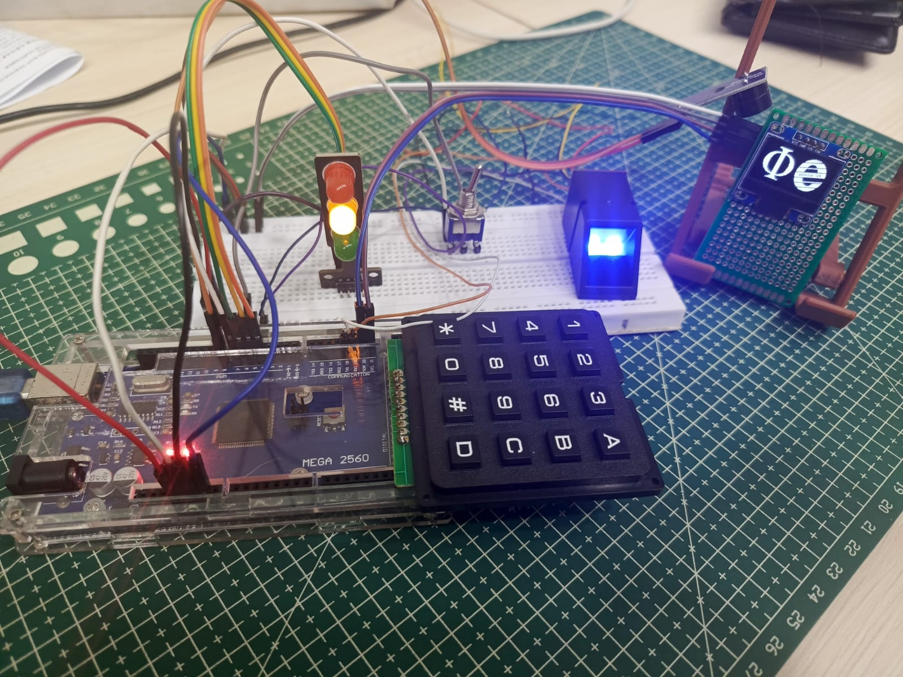
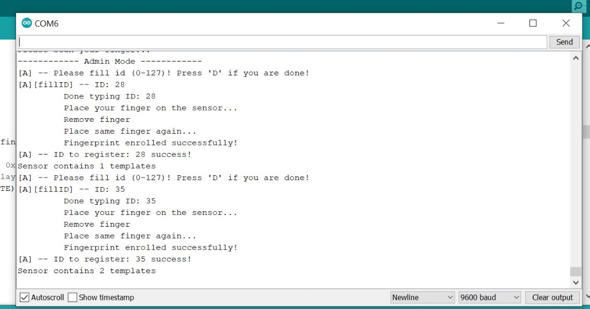

# Fingerprint Recognition System
This Arduino-based project uses the **AS608 Fingerprint Sensor** to create a simple and reliable fingerprint recognition system. It includes functionality to register, delete, and identify fingerprints, with support for *4x4* keypad, LED indicators, and buzzer feedback.

  

 

---

## Features
- Register new fingerprints with a unique ID
- Identify fingerprints and display their ID
- Delete existing fingerprint templates
- Admin mode toggle switch for secure enrollment/deletion
- Buzzer and LED feedback system

---

## Hardware Required

| Component               | Description                       |
|------------------------|-----------------------------------|
| Arduino Mega 2560      | Main microcontroller board        |
| AS608 Fingerprint Sensor | Biometric authentication sensor |
| 4x4 Matrix Keypad      | Input interface for IDs and commands |
| Red, Yellow, Green LEDs| Status indicators                |
| Buzzer                 | Audio feedback                    |
| Toggle Switch          | Admin mode activation             |
| Breadboard & Wires     | For connections                   |

---

## Dependencies
Make sure to install the following libraries via Library Manager or manually:

- [Adafruit_Fingerprint](https://github.com/adafruit/Adafruit-Fingerprint-Sensor-Library)
- [Keypad](https://github.com/Chris--A/Keypad)

---

## How to Use

1. Upload the code to your Arduino Mega.
2. Power the system and enter **Admin Mode** using the toggle switch.
3. In admin mode, use the keypad to:
   - `A` → Register fingerprint
   - `B` → Delete specific fingerprint ID
   - `C` → Delete all fingerprint data
4. Exit Admin Mode (with the toggle switch) and place your finger on the sensor.
5. The serial monitor will display the fingerprint ID if recognized.

---

## Sample Output

  

 

## License
This project is open-source and free to modify for educational or development purposes.
